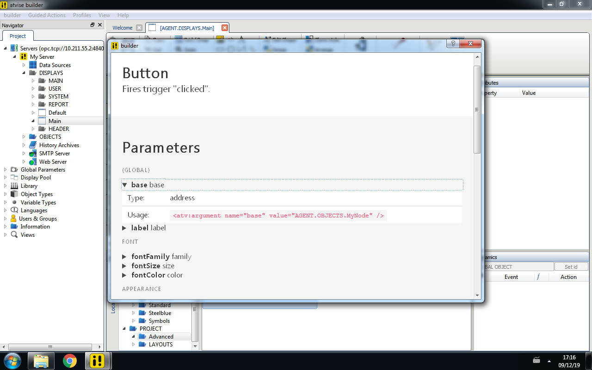

# @atscm/transformer-help

> **This module is still under development**
>
> A transformer that generates help for displays and scripts.

## Usage

> **This module is not yet published!** You'll have to install it manually in the meantime: Install from source with `npm i --save-dev github:atscm/transformer-help`, then run `npm install` and `npm run build` inside it's directory.

- Install the package with npm: `npm i --save-dev @atscm/transformer-help`.
- Add it to your Atviseproject's transformers. (See [_./example/Atviseproject.js_](./example/Atviseproject.js) for an example).
- Run `atscm push` to generate help documents

**Note that this will override any custom help documents.**

## How it works

atscm creates a json file for every display and script describing the parameters available. This transformer reads this information when running `atscm push` and creates an HTML help file for every node pushed.

## Possible improvements

- [ ] Add a custom description from a markdown file (e.g. _src/AGENT/DISPLAYS/Main.display/help.md_) to the generated help document.
- [ ] Support multiple languages
- [ ] Wrap the code to provide type-safe access to parameters. (Currently, when a parameter with name _"test"_ is set to be a number, _webMI.query.test_ is equal to `"13"` instead of `13`)
- [ ] Any ideas/thoughts? -> [Create an issue](https://github.com/atSCM/atscm/issues/new)
